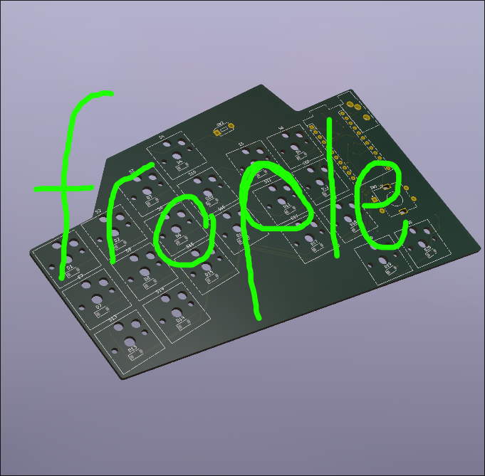

Frople is a split ergonomic keyboard with a 40 key layout. It utilizes a 6x3 main matrix and a 2x1 thumbfan on each side. It uses 2 Arduino Pro Micros as its MCUs and QMK for the firmware. The keys were designed specifically with my hand dimensions in mind, seeing as I took measurements of my finger-length to decide the key stagger. It will take advantage of home-row-mods to allow me to still use my mod keys with such a small key footprint. It also has extra layers to account for the keys that could not fit on the main layer. It uses a TRS cable to communicate between the two halves of the keyboard using serial communcation. In the future it could theoretically be upgraded with a Nice!Nano V2 to allow for wireless communication between the two halves and the computer through BLE (bluetooth low energy). However my current computer does not have bluetooth and the Nice!Nano V2 was more expensive than the Arduino Pro Micro and as such I went with the Pro Micro for the MCU.

I built Frople because I have always been interested by those desktop setup videos, they seemed really cool, and I thought that a split keyboard would be a way to take my desk to the next level. I also made it because I tried out home-row-mods on my normal keyboard using a software called [Kanata](https://github.com/jtroo/kanata) and I found that it really increased my power-useriness and I wanted to take that to the next level. I also am really unsatisfied with my current keyboard, especially the lack of linux compatibal firmware. The final reason I wanted to make a split keyboard is because it sounded like a really fun project to get into hardware design with.

|Item                  |Description                  |Quantity                          |Unit Price CAD   |Unit Price USD|Price + tax * quantity (CAD)|Price + tax * quantity (USD)|Shipping CAD             |shipping USD|Note                                                  |Link                                                                                                                                                                                                                                                                                                                                                                                                                                                                                                                                                                                    |
|----------------------|-----------------------------|----------------------------------|-----------------|--------------|----------------------------|----------------------------|-------------------------|------------|------------------------------------------------------|----------------------------------------------------------------------------------------------------------------------------------------------------------------------------------------------------------------------------------------------------------------------------------------------------------------------------------------------------------------------------------------------------------------------------------------------------------------------------------------------------------------------------------------------------------------------------------------|
|Red Choc Switches     |Key Switches                 |40pcs                             |29.41 + 3.82(tax)|23.93USD      |33.23                       |23.93 USD                   |FREE                     |FREE        |                                                      |https://www.aliexpress.com/item/1005008751312031.html?algo_exp_id=cdb82bfe-653e-4ba2-895b-58cb39c5a6ad-1&pdp_ext_f=%7B%22order%22%3A%22150%22%2C%22eval%22%3A%221%22%2C%22fromPage%22%3A%22search%22%7D&utparam-url=scene%3Asearch%7Cquery_from%3A%7Cx_object_id%3A1005008751312031%7C_p_origin_prod%3A                                                                                                                                                                                                                                                                                 |
|Kailh Hot Swap sockets|Hot swaps                    |1 (they come in packs of 100 :hs:)|12.87 + 1.67(tax)|10.47 USD     |14.54                       |10.47 USD                   |FREE                     |FREE        |even though it was 100 they were still the cheapest   |https://www.aliexpress.com/item/1005006625852715.html?algo_exp_id=faa48a85-e9cd-40e5-93a0-2959f27b83d9-4&pdp_ext_f=%7B%22order%22%3A%22105%22%2C%22spu_best_type%22%3A%22order%22%2C%22eval%22%3A%221%22%2C%22fromPage%22%3A%22search%22%7D&utparam-url=scene%3Asearch%7Cquery_from%3A%7Cx_object_id%3A1005006625852715%7C_p_origin_prod%3A                                                                                                                                                                                                                                             |
|Arduino Pro Micro     |MCU                          |2                                 |8.99 + 1.16      |7.31 USD      |20.3                        |14.62 USD                   |FREE                     |FREE        |                                                      |https://www.aliexpress.com/item/1005008804370504.html?aem_p4p_detail=202601150944273562095180064590002000670&algo_exp_id=7d831326-f6b0-4daf-bc1d-06556968d806-7&pdp_ext_f=%7B%22order%22%3A%2229%22%2C%22eval%22%3A%221%22%2C%22fromPage%22%3A%22search%22%7D&utparam-url=scene%3Asearch%7Cquery_from%3A%7Cx_object_id%3A1005008804370504%7C_p_origin_prod%3A&search_p4p_id=202601150944273562095180064590002000670_2                                                                                                                                                                   |
|Keycaps               |choc low profile ldsa keycaps|4 they come in packs of 10        |5 + 0.65         |4.06 USD      |22.6                        |16.27 USD                   |10 + 1.3                 |8.13USD     |I couldn’t find cheaper unmarked keycaps on aliexpress|https://lowprokb.ca/collections/keycaps/products/ldsa-low-profile-blank-keycaps?variant=44790995878052                                                                                                                                                                                                                                                                                                                                                                                                                                                                                  |
|SJ1-3533NG            |TRS audio jack               |2                                 |3.15 + 0.40      |2.55 USD      |7.1                         |5.11 USD                    |5.54 + 0.72              |4.50 USD    |LCSC was much more expensive bc shipping              |https://www.aliexpress.com/item/1005007818050385.html?spm=a2g0o.productlist.main.2.428d1a0el9FCCd&algo_pvid=9e128295-691e-43e5-8a00-b08dc531eca2&algo_exp_id=9e128295-691e-43e5-8a00-b08dc531eca2-1&pdp_ext_f={%22order%22%3A%221%22%2C%22eval%22%3A%221%22%2C%22fromPage%22%3A%22search%22}&pdp_npi=6%40dis!CAD!3.15!3.15!!!15.45!15.45!%402101c44517685003345927398e8be0!12000042315760823!sea!CA!0!ABX!1!0!n_tag%3A-29910%3Bd%3A53760023%3Bm03_new_user%3A-29895&curPageLogUid=4tlGIj6PnRZU&utparam-url=scene%3Asearch&#124;query_from%3A&#124;x_object_id%3A1005007818050385&#124;_p_origin_prod%3A|
|PCB                   |keyboard pcb                 |1                                 |                 |19.00 USD     |                            |19.00 USD                   |                         |13.25 USD   |                                                      |https://hc-cdn.hel1.your-objectstorage.com/s/v3/6d1642395864fce0_image.png                                                                                                                                                                                                                                                                                                                                                                                                                                                                                                              |
|ec-11                 |rotary encoder               |1 They come in packs of 5         |1.62 + 0.21      |1.31 USD      |1.83                        |1.31 USD                    |FREE                     |FREE        |                                                      |https://www.aliexpress.com/item/1005003824684681.html?algo_exp_id=11db7878-987f-4212-a431-20684286fbad-2&pdp_ext_f=%7B%22order%22%3A%22289%22%2C%22spu_best_type%22%3A%22order%22%2C%22eval%22%3A%221%22%2C%22fromPage%22%3A%22search%22%7D&utparam-url=scene%3Asearch%7Cquery_from%3A%7Cx_object_id%3A1005003824684681%7C_p_origin_prod%3A                                                                                                                                                                                                                                             |
|                      |                             |                                  |                 |              |                            |                            |                         |            |                                                      |                                                                                                                                                                                                                                                                                                                                                                                                                                                                                                                                                                                        |
|Total                 |                             |                                  |                 |              |99.6 CAD (not including pcb)|90.71 USD                   |17.56 (Not including pcb)|25.88       |full cost:: 116.59 USD                                |                                                                                                                                                                                                                                                                                                                                                                                                                                                                                                                                                                                        |

